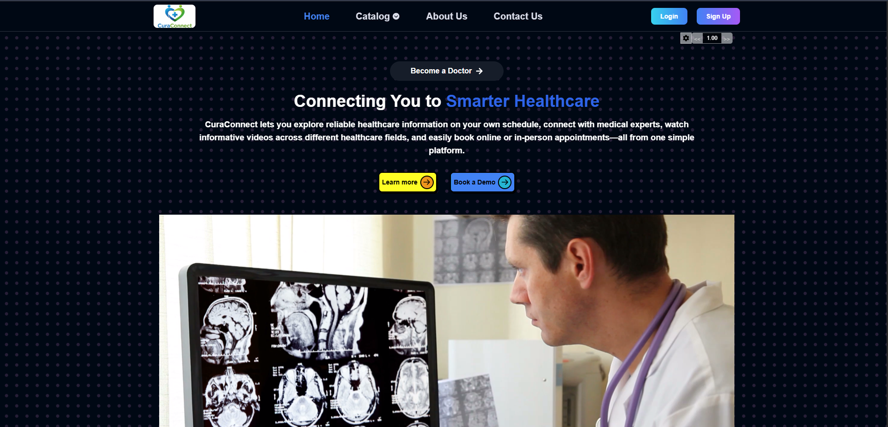
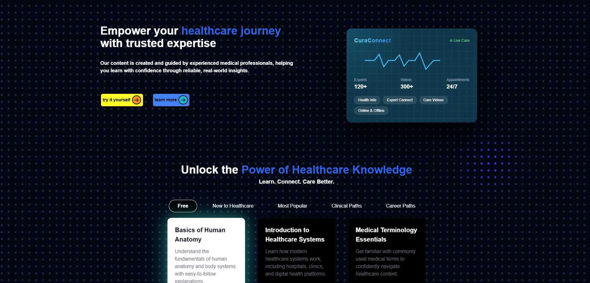
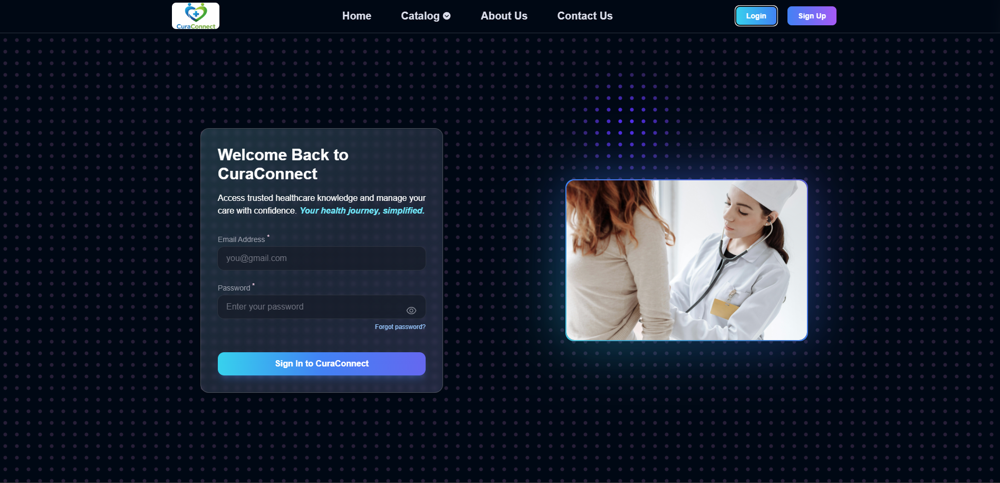
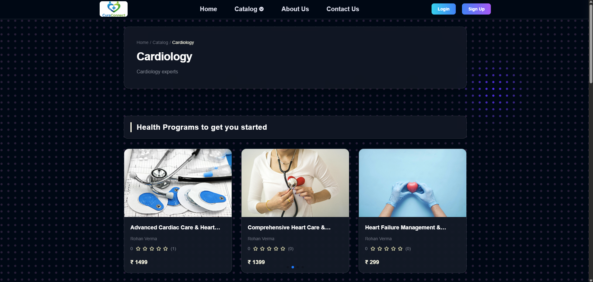
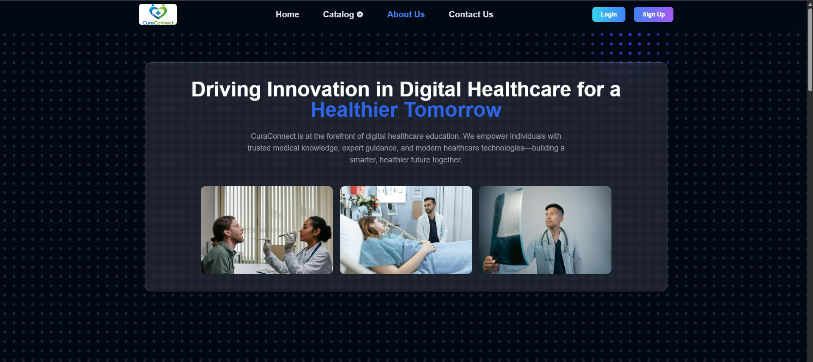
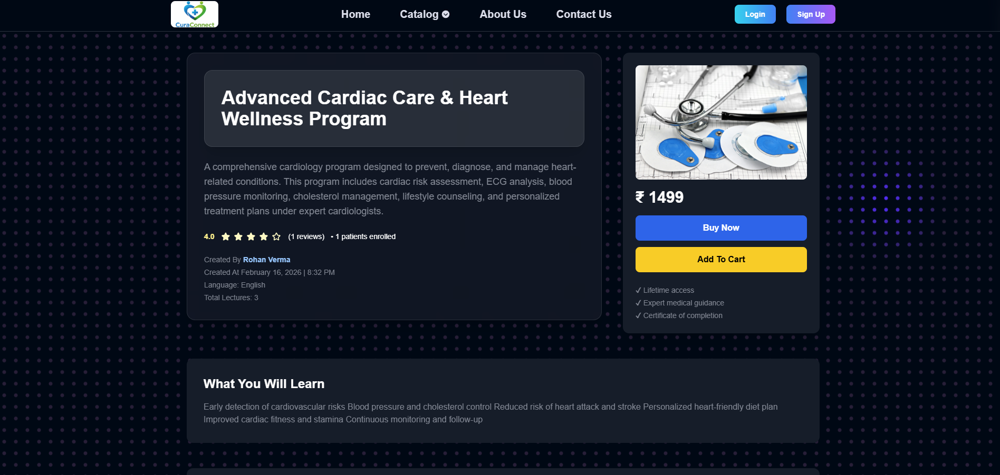

<h1 align="center">🏥 CuraConnect</h1>

<p align="center">
  A Production-Ready Full-Stack Healthcare Platform (MERN)
</p>

<p align="center">
  <a href="https://cura-connect-main.vercel.app" target="_blank">
    
  </a>
  <a href="https://cura-connect-five.vercel.app" target="_blank">
    
  </a>
</p>

---

## 🚀 Overview

CuraConnect is a scalable MERN stack healthcare platform that allows users to:

- 🔐 Register & authenticate securely  
- 📚 Explore health programs  
- 🎥 Access expert-led video content  
- 💳 Enroll via Razorpay payments  
- ☁️ Upload media via Cloudinary  
- 📊 Manage dashboards (Doctor / Patient)

---

## 🧠 Tech Stack

### 🖥 Frontend
- React.js  
- Redux Toolkit  
- Vite  
- Tailwind CSS  
- React Router  

### ⚙ Backend
- Node.js  
- Express.js  
- MongoDB Atlas  
- REST APIs  
- JWT Authentication  
- Razorpay  
- Cloudinary  

---

## 🏗 System Architecture
Frontend (React + Redux)
↓
REST API (Express.js)
↓
MongoDB Atlas Database
↓
Cloudinary (Media) & Razorpay (Payments)

---

## 🔐 Key Features

✔ JWT-Based Authentication  
✔ Role-Based Authorization (Doctor / Patient)  
✔ Secure Payment Verification  
✔ Scalable MVC Backend Architecture  
✔ Global State Management (Redux Toolkit)  
✔ Production Deployment on Vercel  

---

## 🌍 Live Deployment

🔗 Frontend:  
https://cura-connect-main.vercel.app  

🔗 Backend:  
https://cura-connect-five.vercel.app  

---

## ⚙️ Local Setup

### Clone Repository
```bash
git clone https://github.com/aryan9855/CuraConnect.git
```
cd Server
npm install
npm run dev

cd curaConnect
npm install
npm run dev


👨‍💻 Developer

Aryan Singhal
Full-Stack MERN Developer
Passionate about scalable web applications 🚀


---

## 📸 Screenshots

### 🏠 Homepage
<p align="center">
  
  <br/><br/>
  
</p>

### 🔐 Login
<p align="center">
  
</p>

### 📚 Catalog
<p align="center">
  
</p>

### 🔎 About Us
<p align="center">
  
</p>

### 📘 Health Program Page
<p align="center">
  
</p>

